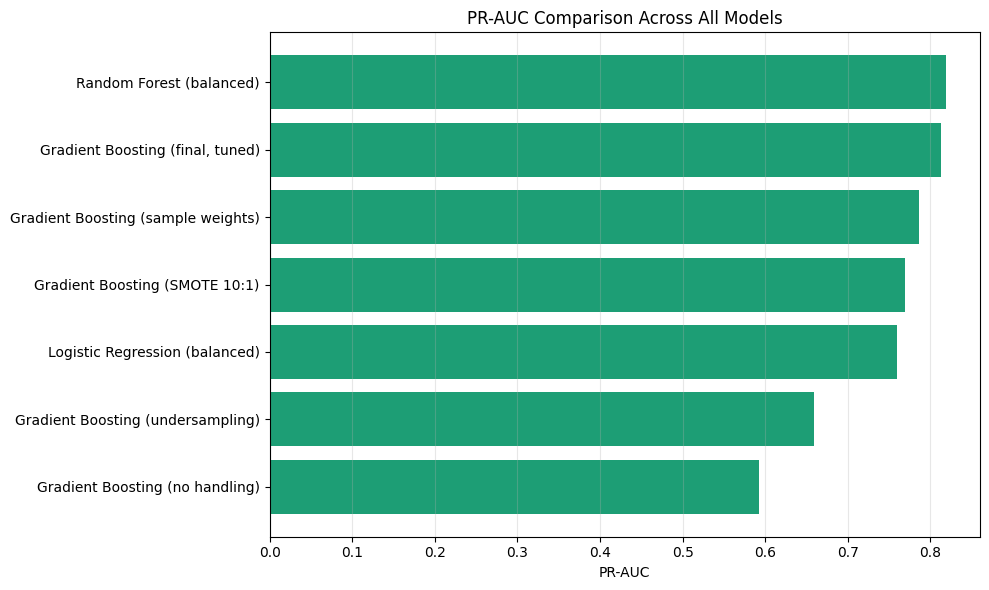
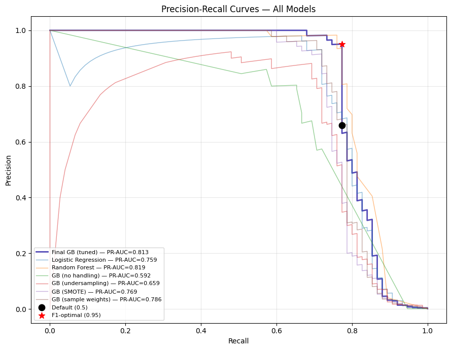
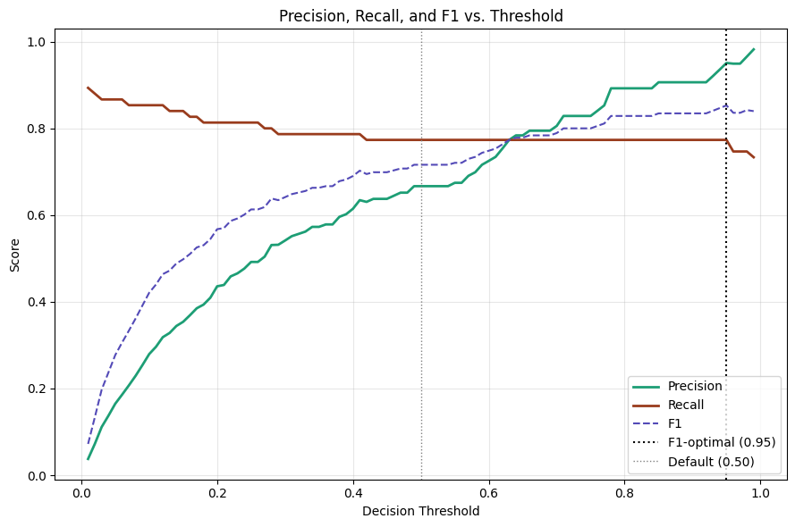
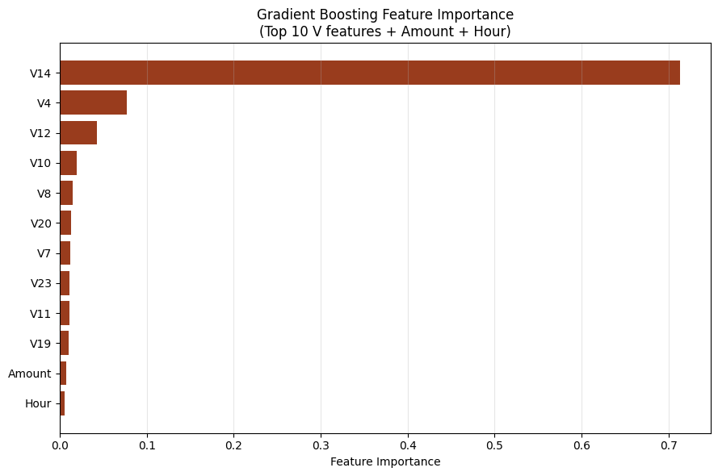

# Credit Card Fraud Detection

**Primary metric: PR-AUC — not accuracy, not ROC-AUC. Accuracy is 99.83% for
any model that predicts no fraud.**

## Overview

This project detects fraudulent credit card transactions in a highly
imbalanced dataset: **492 fraud cases out of 284,807 transactions (0.17%)**.
Four imbalance-handling strategies were compared on Gradient Boosting,
alongside Logistic Regression and Random Forest baselines, with
hyperparameter tuning applied to the best-performing configuration.

Dataset: [Kaggle — mlg-ulb/creditcardfraud](https://www.kaggle.com/datasets/mlg-ulb/creditcardfraud)
Full notebook: [fraud_detection.ipynb](./fraud_detection.ipynb)

## Why not accuracy or ROC-AUC?

A model that predicts "no fraud" for every transaction scores 99.83%
accuracy while catching zero fraud — accuracy is meaningless here. ROC-AUC
is also misleading: its False Positive Rate is calculated relative to the
~56,000+ legitimate test transactions, so even a real, non-trivial number of
false positives barely moves it. **PR-AUC**, built from precision and recall
relative to the fraud class only, is the metric used throughout this
project.

## Results

| Model | PR-AUC | Precision | Recall | F1 | ROC-AUC |
|---|---|---|---|---|---|
| **Random Forest (balanced)** | **0.8190** | 0.9800 | 0.6533 | 0.7840 | 0.9448 |
| Gradient Boosting (final, tuned) | 0.8131 | 0.6667 | 0.7733 | 0.7160 | 0.9820 |
| Gradient Boosting (sample weights) | 0.7863 | 0.1442 | 0.8400 | 0.2461 | 0.9853 |
| Gradient Boosting (SMOTE 10:1) | 0.7690 | 0.4603 | 0.7733 | 0.5771 | 0.9879 |
| Logistic Regression (balanced) | 0.7592 | 0.0271 | 0.9333 | 0.0526 | 0.9869 |
| Gradient Boosting (undersampling) | 0.6591 | 0.0465 | 0.8933 | 0.0883 | 0.9873 |
| Gradient Boosting (no handling) | 0.5922 | 0.8600 | 0.5733 | 0.6880 | 0.8332 |

*Test set: 75 fraud cases out of 56,962 transactions, from a time-based
80/20 split (no shuffling).*



**Random Forest achieved the highest PR-AUC**, though Gradient Boosting
(tuned) offers meaningfully higher recall (77.3% vs 65.3%) at the cost of
lower precision (66.7% vs 98.0%) — the right choice depends on whether
missed fraud or false alarms are costlier for a given deployment.

## Precision-Recall Curve



All seven models plotted together, with the default (0.5) and F1-optimal
thresholds marked on the final tuned Gradient Boosting model.

## Threshold Analysis



| Scenario | Threshold | Precision | Recall | F1 |
|---|---|---|---|---|
| High Precision | 0.90 | 0.9062 | 0.7733 | 0.8345 |
| **Balanced (F1-optimal)** | **0.95** | 0.9508 | 0.7733 | 0.8529 |
| High Recall | 0.10 | 0.2795 | 0.8533 | 0.4211 |

## Business Cost Analysis

Assuming a **$122.21 average loss per missed fraud case** (mean fraud
transaction amount) and an **assumed $10 review cost per false alarm**:

| Scenario | Threshold | FN | FP | Total Cost |
|---|---|---|---|---|
| High Precision | 0.90 | 17 | 6 | $2,137.57 |
| **Balanced (F1-optimal)** | **0.95** | 17 | 3 | **$2,107.57** |
| High Recall | 0.10 | 11 | 165 | $2,994.31 |

The **Balanced (0.95) threshold minimizes total expected cost**. This
result is sensitive to the assumed $10 false-positive cost — recompute with
actual operational costs before production deployment.

## Why Gradient Boosting vs. Random Forest?

Random Forest trains many independent decision trees in parallel and
averages their votes, reducing variance through bagging. Gradient Boosting
instead builds trees **sequentially**, where each new tree specifically
targets the residual errors of the combined ensemble so far — this
error-correcting mechanism tends to focus increasing attention on hard-to
classify minority-class (fraud) examples over successive rounds, even before
any explicit imbalance handling is applied.

## Imbalance-Handling Strategies Compared

- **No handling** — raw ~578:1 imbalanced training data
- **Random undersampling** — majority class reduced to match minority (492:492)
- **SMOTE (10:1)** — synthetic fraud examples generated via interpolation
- **Sample weights** — inverse-class-frequency reweighting of the loss function (best-performing strategy on this dataset)

## Feature Importance



The `V1`–`V28` features are anonymized PCA components, so individual
importances can't be mapped to real-world business meaning — but their
relative ranking shows the model isn't relying on noise.

## Setup

```bash
pip install -r requirements.txt
```

See [NOTE.md](./NOTE.md) for dataset download instructions (too large for GitHub).

## Limitations

- Anonymized PCA features limit business interpretability
- Dataset spans only 2 days (September 2013) — no validation against seasonal drift
- Test set contains only 75 fraud cases, so threshold-level FP/FN counts carry real sampling variance
